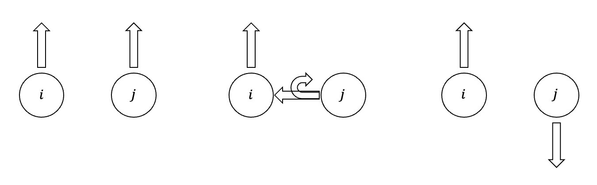
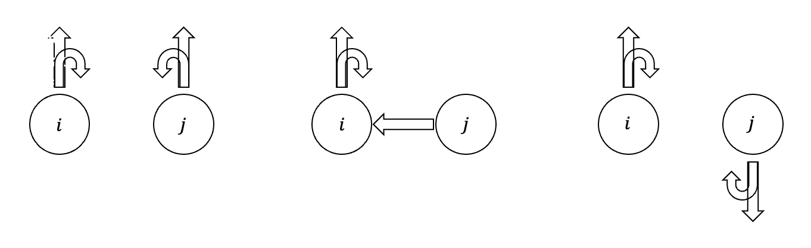
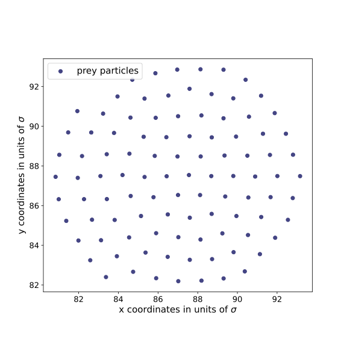
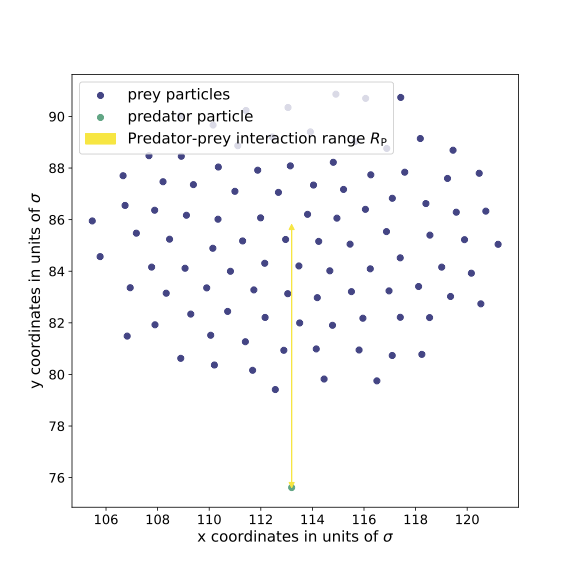
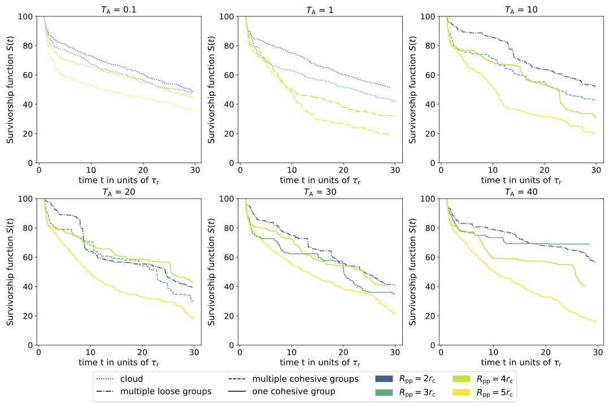

# Torque-Based Predator–Prey Interactions in Active Matter Simulations
Bachelor project at TU Berlin in the group “Statistical Soft Matter Physics and Biological Systems”.

## Overview
This project investigates predator–prey dynamics in an active active brownian particle system where interactions are governed by torque-based particle behavior. 

The project simulates how local alignment, rotational interactions, and avoidance mechanisms influence predator success rates and emergent collective behavior.

## Motivation
Understanding the dynamics between predators and prey has been a fundamental pursuit in
ecology and population dynamics. These interactions play a crucial role in shaping ecosystems, influencing biodiversity, and even impacting human activities such as agriculture and conservation efforts. 
## Model & Method
This repository includes an extended model of Active Brownian Particles
(ABPs) to study predator-prey systems, with a specific focus on how the collective behavior
of prey affects predation success. The model simulates particles in a two-dimensional space,
incorporating non-reciprocal torque interactions and repulsive steric forces derived from the
Weeks-Chandler-Andersen (WCA) potential. Prey particles $i$ and $j$ experience torques leading to alignment and cohesion (Figures 1 & 2), as well as repulsive torque from the predator $P$ (Figure 3).
<div style="display: flex; gap: 20px;">
  <figure>
    
    <figcaption>Fig 1: Prey alignment</figcaption>
  </figure>

  <figure>
    
    <figcaption>Fig 2: Prey cohesion</figcaption>
  </figure>

  <figure>
    
    <figcaption>Fig 3: Predator interactions</figcaption>
  </figure>
</div>

## Simulation setup
In every simulation, the prey particles are arranged in concentric circles around the center of the simulation area (figure 4), with their orientations pointing inwards. The prey particles are given a time of $t= 1\: \tau_{\text{r}}$ to move and leave the setup
position. After this period, the predator spawns one interaction range $R_{\text{P}}$ below the center
of the prey particles, with its orientation vector pointing upwards (figure 5). The result is
an initial phase where the predator interacts with the prey group and a second phase where
the predator moves around hunting for the prey. The total simulation time is $t= 30\: \tau_{\text{r}}$.
<div style="display: flex; gap: 20px;">
  <figure>
    
    <figcaption>Fig 4: Initial prey positions</figcaption>
  </figure>

  <figure>
    
    <figcaption>Fig 5: Predator position</figcaption>
  </figure>
</div>

## Results
The simulations show that prey particles in the absence of a predator exhibit four distinct
al states: cloud-like, multiple loose groups, multiple cohesive groups, and one cohesive
group. These states transition based on the prey-prey interaction torque $T_\text{A}$ and radius $R_\text{pp}$.
Prey survival rates vary strongly, with the predator’s success in catching prey highly de-
pending on the prey’s interaction parameters and their resulting collective behavior. When
prey exhibit cloud-like movement patterns, predator success is low. The prey move almost
independently, each evading the predator on its own, leading to a continuous decline in the
number of living prey particles. High predator success occurs when prey moves in cohesive
groups. These groups are more easily targeted once within the predator’s range, leading to
large singular eating events. Large groups also interfere with the prey evasion mechanism
However, the degree of predator success varies significantly across simulations due to the
complex interplay between prey-prey and prey-predator interactions. Interestingly, specific
combinations of prey-prey interaction parameters for cohesive prey groups resulted in mini-
mal predator success, highlighting a favorable parameter set for prey cohesion and avoidance.
The number of survivors per time is displayed in figure 6 for different prey-prey interaction parameters.


<figcaption>Fig 6: Prey survival rates for different prey-prey interaction parameters</figcaption>

## How to Run
Follow these steps to reproduce the simulation:
### 1. Install dependencies
```bash
pip install -r requirements.txt
```
### 2. Run a single simulation
```bash
python -m scripts.run_simulation --config "base.yaml" --output "run_001"
```
### 3. Run a parameter sweep (optional)
```bash
python -m scripts.run_sweep --config "base_sweep.yaml" --output "sweep_001"
```
### 4. Generate animation
```bash
python -m scripts.run_animation --config "run_001" --interval 50
```
### 5. Create analysis plots
```bash
python -m scripts.visualize_sweep_results --sweep_name "sweep_001"
```

## Thesis

The full thesis is available here:

📄 [Download PDF](docs/bechelor_thesis.pdf)